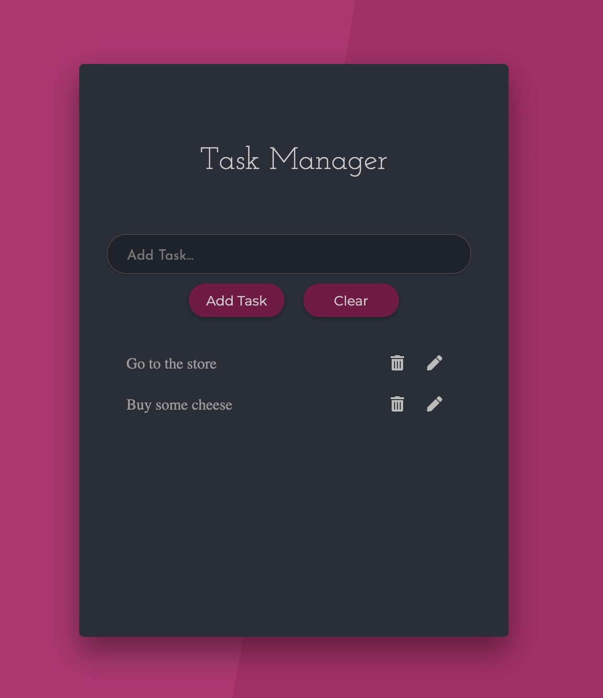

This is a Task Manager App using React with Context API and Hooks.

The task manager allows the user to add tasks, delete tasks, and edit tasks. Also, after refreshing the page, the tasks will remain in the task list.

Followed along with the following YouTube video by Code and Create:
https://www.youtube.com/watch?v=fqup-BL3VjI

